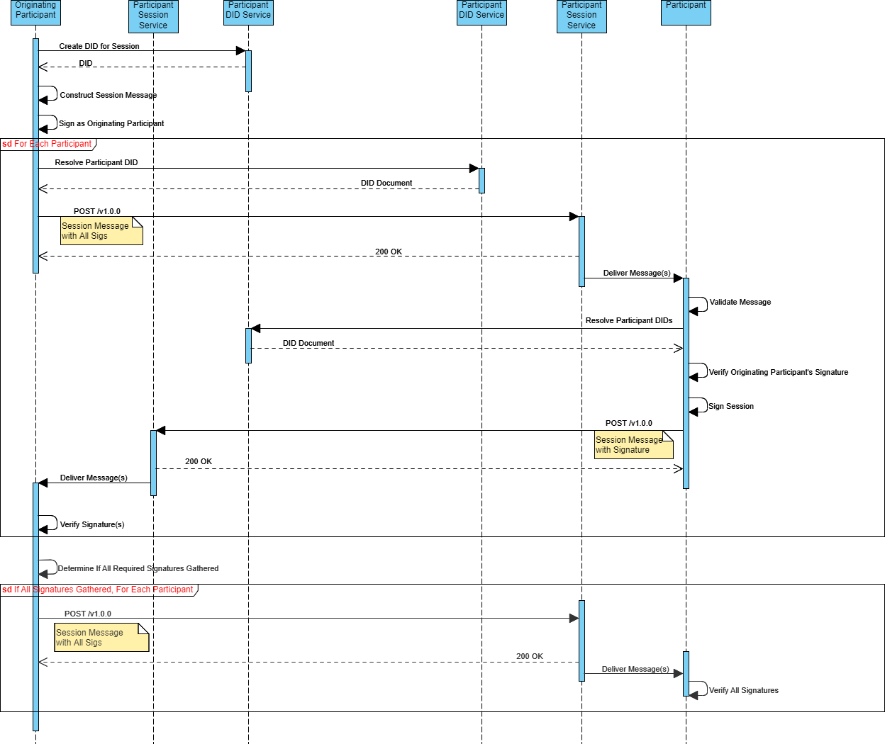

# Establish Session Message

## Overview

The `EstablishSession` message defines all of the properties required in a message to establish a [FairX Session](https://github.com/fairxio/protocol/tree/main/glossary.md#fairx-protocol-glossary-fairx-session).  An Active FairX Session is required in order to perform Executions or other operations between the participants.  

## Protocol Description




## Establish Session Message

The `EstablishSession` message is embedded within a `CollectionsWrite` [DecentralizedWebNode Interface Message](https://identity.foundation/decentralized-web-node/spec/#write) with a specific [Session](https://github.com/fairxio/protocol/blob/main/did/messages/session-schema.json) schema.  

For example, a Participant who wishes to establish a Session with other Participants, simply needs to resolve each Participant's DID, and interact with each Participant's FairX Session Node by passing them a [Session](https://github.com/fairxio/protocol/blob/main/did/messages/session-schema.json) Message:

```json
{  // Request Object
  "target": "did:fairx:zfjodifjsoidfjsid", // A participant of the Session
  "messages": [  // DWN Message Objects
  {
    "data":"ewoiJHNjaGVtYSI6Imh0dHBzOi8vZ2l0aHViLmNvbS9mYWlyeGlvL3Byb3RvY29sL2Jsb2IvbWFpbi9kaWQvbWVzc2FnZXMvc2Vzc2lvbi1zY2hlbWEuanNvbiIsCiJpZCI6ICJkaWQ6ZmFpcng6emtqZm9kc2tmanNvZGZranNkb2ZqIiwKICAgICJwYXJ0aWNpcGFudHMiOiBbCgogICAgICAgIHsKICAgICAgICAgICAgImlkIjogImRpZDpmYWlyeDp6ZmpvZGlmanNvaWRmanNpZCIKICAgICAgICB9LAogICAgICAgIHsKICAgICAgICAgICAgImlkIjogImRpZDpmYWlyeDp6ZmpvZGlmanNvaWRmanNpZSIKICAgICAgICB9LAogICAgICAgIHsKICAgICAgICAgICAgImlkIjogImRpZDpmYWlyeDp6ZmpvZGlmanNvaWRmanNpZiIKICAgICAgICB9CiAgICBdLAogICAgImV4ZWN1dGFibGVzIjogWwoKICAgICAgICB7CiAgICAgICAgICAgICJpZCI6ICJkaWQ6a2V5OnprbGtmamxza2RqZnNsa2RmanNsa2RmanNkIiwKICAgICAgICAgICAgInR5cGUiOiAid2FzbSIsCiAgICAgICAgICAgICJ1cmwiOiAiaXBmczovL2JhZnliZWlnZHlyenQ1c2ZwN3VkbTdodTc2dWg3eTI2bmYzZWZ1eWxxYWJmM29jbGd0cXk1NWZiemRpIgogICAgICAgIH0KCgogICAgXSwKICAgICJzaWduYXR1cmVzIjogWwogICAgICAgIAogICAgXQp9",
    "descriptor": {
        "nonce":"8046352f-f06a-4381-bff0-d46e8e3444bf",
        "method":"CollectionsWrite",
        "dataCid":"QmcRD4wkPPi6dig81r5sLj9Zm1gDCL4zgpEj9CfuRrGbzF",
        "dataFormat":"Base64Url"
    }
    
  }
  ]
}
```